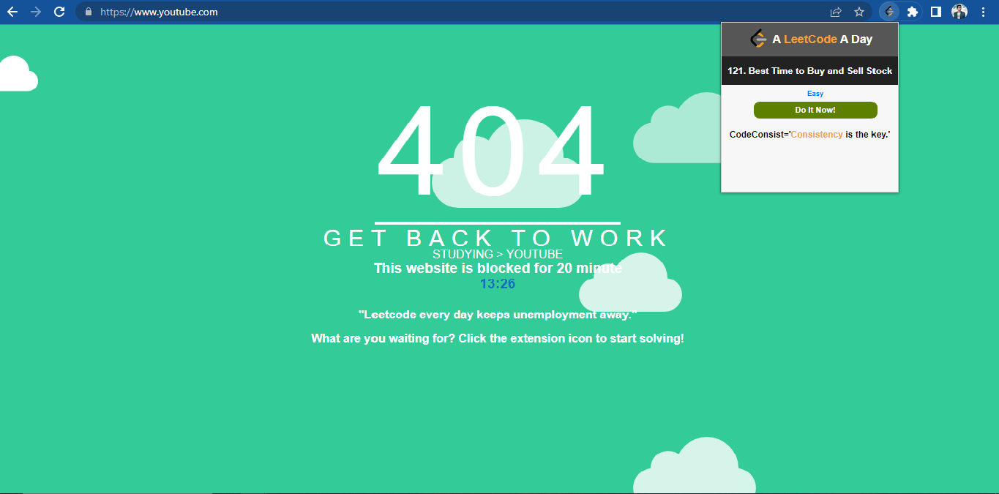

# CodeConsist-Chrome-Extension

# CodeConsist
Chrome extension that pops up a random LeetCode top 100 question and blocks the social media and streaming platforms to increase productivity.

## Features
1. Increases productivity by blocking Social Media and Streaming Platforms.
2. Display a random top 100 question and its difficulty
3. Link to the question

## Installation
### Clone
- Clone this repo to your local machine using `https://github.com/MohammedNayeem9/CodeConsist-Chrome-Extension.git`

### Setup
- Open the Extension Management page by navigating to chrome://extensions.
- The Extension Management page can also be opened by clicking on the Chrome menu, hovering over **More Tools** then selecting **Extensions**.
- Enable Developer Mode by clicking the toggle switch next to **Developer mode**.
- Click the **LOAD UNPACKED** button and select the extension directory.

## Features
- Click on the icon on the bar will pop up a random questions.
- Click on the Do It Now! button will open a window for that question.
- Blocks the social media and streaming platforms to increase productivity.
